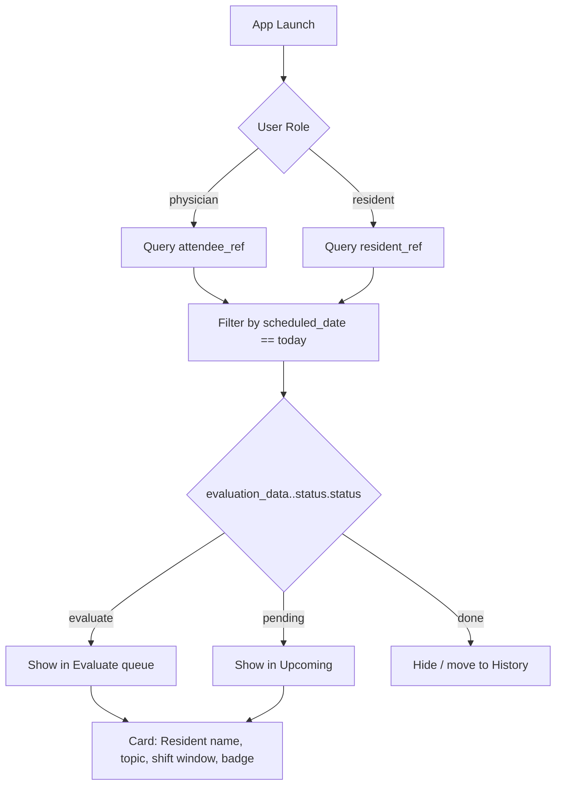

# EMMA Firestore Schema Documentation (2025-09 Snapshot)

This document reflects the production layout that the Cloud Functions in `functions/` expect today. Field names are normalized to the snake_case convention used throughout the backend (camelCase variants that exist in older data should be migrated).

---

## Collection Schemas

### `users`
```jsonc
{
  "display_name": "Jane Smith, MD",          // Primary display name (used for matching)
  "first_name": "Jane",                      // Optional; helps build display_name if missing
  "last_name": "Smith",                      // Optional
  "email": "jane.smith@emma.org",           // Login email (unique)
  "role": "physician",                       // physician | resident | admin
  "department": "Emergency Medicine",        // Department/track shorthand
  "pgy_level": "PGY-3",                      // Resident level string; null for attendings
  "is_active": true,                           // Exclude false users from matching loops
  "is_admin": false,                           // Grants elevated API access in callable functions
  "permissions": ["shift_matching.run"],      // Optional granular permissions
  "fcm_token": "token-abc",                   // Primary device token for push
  "device_tokens": ["token-abc", "token-def"],// Historical tokens (optional)
  "profile_photo": {                           // Optional rich photo payload (aligns with Flutter UI)
    "url": "https://.../photo.jpg",
    "blur_hash": "LEHV6nWB2yk8pyo0adR*.7kCMdnj"
  },
  "created_at": Timestamp,                     // Auth creation mirror
  "updated_at": Timestamp,                     // Last profile update
  "last_login_at": Timestamp,                  // Last successful login
  "schema_version": 1                          // Increment with breaking schema changes
}
```
> **Document ID**: must match the Firebase Auth UID so callable functions can resolve `context.auth.uid`.

### `schedules`
```jsonc
{
  "attendee": DocumentReference("/users/attendingUid"),      // Used for security rules & joins
  "attendee_ref": "/users/attendingUid",                    // String mirror to support indexing
  "resident": DocumentReference("/users/residentUid"),
  "resident_ref": "/users/residentUid",

  "scheduled_date": Timestamp,                               // Shift anchor date (start)
  "shift_timings": {
    "start_time": Timestamp,
    "end_time": Timestamp,
    "duration_minutes": 480                                   // Optional convenience metric
  },

  "auto_matched": true,                                       // True when produced by matcher
  "match_confidence": 72,                                     // 0-100 score from matcher
  "overlap_hours": 8.0,                                       // Calculated overlap duration
  "assigned_topic": {
    "category_name": "Emergency Medicine",
    "topic_title": "General Emergency Medicine",
    "is_category": false,
    "topic_ref": DocumentReference("/topics/topicId")        // Optional (populate when available)
  },

  "evaluation_data": {
    "attendee_evaluation": {
      "status": {
        "status": "evaluate",                                // evaluate | pending | done
        "last_updated": Timestamp
      },
      "scores": {},                                           // Latest competency deltas (mirrors evaluation doc)
      "feedback": "",
      "completed_at": null
    },
    "resident_evaluation": {
      "status": {
        "status": "evaluate",
        "last_updated": Timestamp
      },
      "scores": {},
      "feedback": "",
      "completed_at": null
    }
  },

  "startNotificationSentToPhysician": false,
  "startNotificationSentToResident": false,
  "endNotificationSentToPhysician": false,
  "endNotificationSentToResident": false,
  "endNotificationFollowupSentToPhysician": false,
  "endNotificationFollowupSentToResident": false,

  "resident_evaluation_completed": false,
  "attending_evaluation_completed": false,

  "created_at": Timestamp,
  "updated_at": Timestamp,
  "schema_version": 1,
  "test": false
}
```
> **Document ID**: `YYYYMMDD_attendingId_residentId` for manual runs or `generateMatchId` when auto-matched.

### `evaluations`
```jsonc
{
  "evaluation_id": "eval_1695269123000_ab12cd", // External identifier
  "schedule_id": "20250915_attending_resident", // Foreign key to schedules/<id>
  "shift_id": "20250915_attending_resident",    // Legacy alias
  "evaluator_id": "residentUid",
  "evaluator_type": "resident",                 // resident | attending
  "evaluated_user_id": "attendingUid",          // Optional if evaluator_type === 'attending'
  "overall_rating": 4,
  "competency_ratings": {
    "medical_knowledge": 4,
    "patient_care": 5,
    "communication": 4,
    "professionalism": 5,
    "systems_based_practice": 4,
    "practice_based_learning": 4
  },
  "strengths": "Handled airway expertly",
  "areas_for_improvement": "Document faster",
  "additional_comments": "Great teamwork",
  "submitted_at": Timestamp,
  "updated_at": Timestamp,
  "is_final": true
}
```
> The Cloud Function updates the linked schedule’s `evaluation_data.<role>` block when a document is created.

### `topics`
```jsonc
{
  "topic_data": {
    "title": "Cardiac Emergencies",
    "description": "ED management of ACS and arrhythmias",
    "category": "Emergency Medicine",
    "is_category": false,
    "rubric_descriptions": {
      "level_1": "Needs significant improvement",
      "level_3": "Meets expectations",
      "level_5": "Outstanding"
    },
    "milestone_codes": ["EM-1", "EM-2"],
    "weights": {
      "pgy1": 25,
      "pgy2": 35,
      "pgy3": 40
    }
  },
  "is_active": true,
  "schema_version": 1,
  "created_at": Timestamp,
  "updated_at": Timestamp
}
```
> `topics_cleaned` follows the same structure after deduplication scripts run.

### Operational Collections
- `shift_matching_logs`: Stores run metadata `{ run_id, run_timestamp, date_range, attending_shifts_count, resident_shifts_count, matches_count, dry_run, errors[] }`.
- `schedule_matching_logs`: Output from manual verifier scripts (`scripts/manual_shift_matching-verify-if-accurate.js`).
- `rate_limit_violations`: Captures callable API rate-limit breaches `{ uid, call, reason, counts, ts }`.

Planned-but-not-yet-used collections (keep reserved names):
- `notifications`
- `notification_settings`
- `block_time`

---

## Home Screen Matching & Status Flow



### Query Examples
```javascript
// Physicians
const snap = await db.collection('schedules')
  .where('attendee_ref', '==', `/users/${currentUser.uid}`)
  .where('scheduled_date', '>=', todayStart)
  .where('scheduled_date', '<=', todayEnd)
  .where('evaluation_data.attendee_evaluation.status.status', 'in', ['evaluate', 'pending'])
  .orderBy('scheduled_date')
  .get();

// Residents
const snap = await db.collection('schedules')
  .where('resident_ref', '==', `/users/${currentUser.uid}`)
  .where('scheduled_date', '>=', todayStart)
  .where('scheduled_date', '<=', todayEnd)
  .where('evaluation_data.resident_evaluation.status.status', 'in', ['evaluate', 'pending'])
  .orderBy('scheduled_date')
  .get();
```

### Rendering Helpers
```javascript
function getProfilePhoto(userDoc) {
  const photo = userDoc.profile_photo;
  if (photo?.url) {
    return { url: photo.url, blurHash: photo.blur_hash || null };
  }
  return { url: '/assets/default-avatar.png', blurHash: null };
}
```

Real-time UI updates should listen to the same query with `.onSnapshot`/`StreamBuilder`.

---

## Composite Indexes

Current production indexes (synced via `scripts/fetch_firebase_web_config.sh`):
1. `schedules`: `attendee ASC`, `evaluation_data.attendee_evaluation.status.status ASC`
2. `schedules`: `attendee ASC`, `scheduled_date ASC`
3. `schedules`: `attendee ASC`, `scheduled_date DESC`

Recommended additions once the Flutter client issues more resident-centric queries:
- `schedules(attendee_ref ASC, scheduled_date ASC, evaluation_data.attendee_evaluation.status.status ASC)`
- `schedules(resident_ref ASC, scheduled_date ASC, evaluation_data.resident_evaluation.status.status ASC)`
- `users(role ASC, is_active DESC)` for roster management views.

---

## Migration Notes

- Normalize all field names to snake_case (`display_name`, `scheduled_date`, etc.) and drop legacy camelCase duplicates (`displayName`, `scheduledDate`).
- Remove misspelled schedule flags such as `evaluatedByAtendee`; rely on `evaluation_data` and `_completed` booleans instead.
- Consolidate photo data under `profile_photo` and deprecate `photoUrl`/`displayPhoto` variants.
- Ensure every schedule created prior to 2025-09 has an `evaluation_data` block; rerun a backfill script to seed default statuses so the new indexes function.

---

## Verification

After any schema change, run:
```
./scripts/fetch_firebase_web_config.sh
node scripts/verify_firebase_setup.mjs
```
These commands refresh the local metadata snapshot and confirm parity with the live project.
